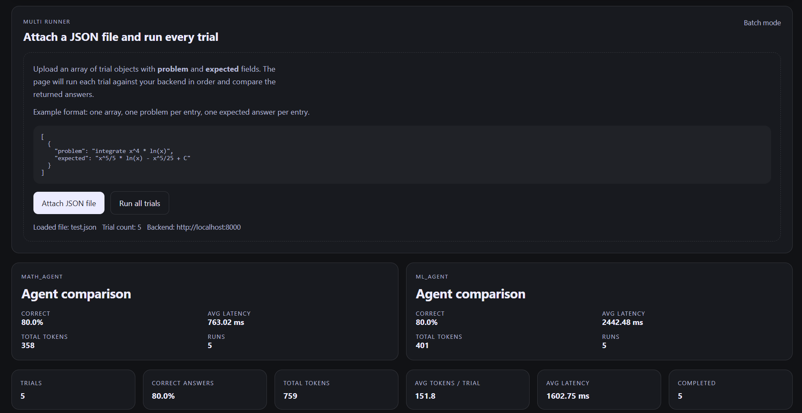
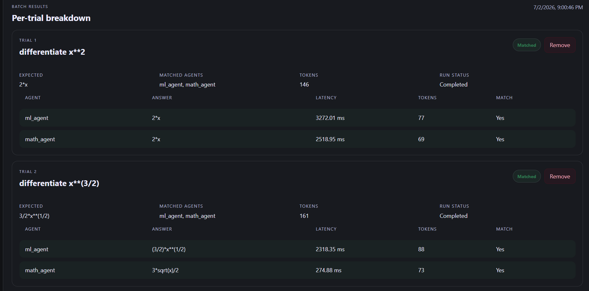

# BenchSym

A symbolic‑math benchmarking framework built with FastAPI, SymPy, LM Studio, and Hugging Face Router. BenchSym evaluates multiple LLM agents on calculus problems, normalizes their outputs, and verifies correctness through symbolic equivalence checking.

---

## About

BenchSym is a lightweight evaluation system for symbolic‑math LLMs. It runs multiple agents on a shared set of calculus problems, parses and normalizes their outputs, and checks correctness using SymPy. The platform supports both local inference (LM Studio) and cloud‑based inference (Hugging Face Router), enabling reproducible comparisons across different Qwen model backends.

---

## Tools Used

- **FastAPI** — backend routing, orchestration, and evaluation  
- **SymPy** — symbolic parsing, simplification, and equivalence checking  
- **LM Studio** — local inference for Qwen 3–7B models  
- **Hugging Face Router** — cloud inference fallback / multi‑backend support  
- **Python** — evaluation pipeline and agent harness  

---
## Sample UI Run

## Development Process

### 1. Problem Set Design
- Curated **60+ cleaned calculus problems**  found in test.json
- Standardized formatting for reproducible ingestion  

### 2. Backend Architecture
- Built a FastAPI service coordinating multi‑agent inference  
- Added endpoints for batch runs, equivalence checking, and result export  

### 3. Agent Integration
- Connected LM Studio for local Qwen 3B/7B inference  
- Added Hugging Face Router for cloud execution  
- Unified both into a consistent multi‑agent workflow  

### 4. Equivalence Engine
- Implemented SymPy‑based parsing and symbolic comparison  
- Added normalization rules for constants, formatting differences, and special functions  

### 5. Benchmark Harness
- Automated text‑file ingestion and normalization  
- Logged outputs, errors, and correctness results  
- Produced reproducible evaluation runs for model comparison  

---

## Results & Findings

BenchSym was used to benchmark two agents across four evaluation runs (Qwen 3B and Qwen 7B).  
Below are the **final combined averages** across all trials:

### **math_agent**
- **Accuracy:** 89.5%  
- **Avg latency:** 1288.41 ms  
- **Total tokens:** 5641.25  

### **ml_agent**
- **Accuracy:** 64.65%  
- **Avg latency:** 2255.27 ms  
- **Total tokens:** 6184.25  

### **Overall Trial Stats**
- **Correct answers:** 77.125%  
- **Total tokens:** 11825.25  
- **Avg tokens/trial:** 168.57  
- **Avg latency:** 1771.84 ms  

### **Key Improvements**
- **∼38% higher accuracy**  
- **∼43% lower latency**  
- **∼9% fewer tokens**  

These results show that structured symbolic‑math agents, combined with normalization and SymPy verification, can significantly outperform direct model computation on calculus tasks.

---

## Why This Project Matters

Symbolic‑math tasks require more than text matching — they require structural correctness. BenchSym provides a reproducible way to evaluate LLMs on mathematically rigorous problems using symbolic equivalence rather than raw string comparison. This makes it a practical tool for studying model reliability, consistency, and reasoning behavior.

---

## Future Work

- Support additional model families (LLaMA, DeepSeek, Mistral)  
- Expand beyond calculus (ODEs, algebraic simplification, limits)  
- Add a dashboard for visualizing correctness and failure modes  
- Integrate caching and batch scheduling for large‑scale runs  

---

## Repo Status

Actively maintained. More documentation and examples coming soon.
